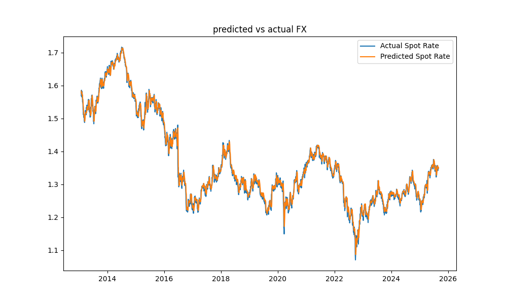
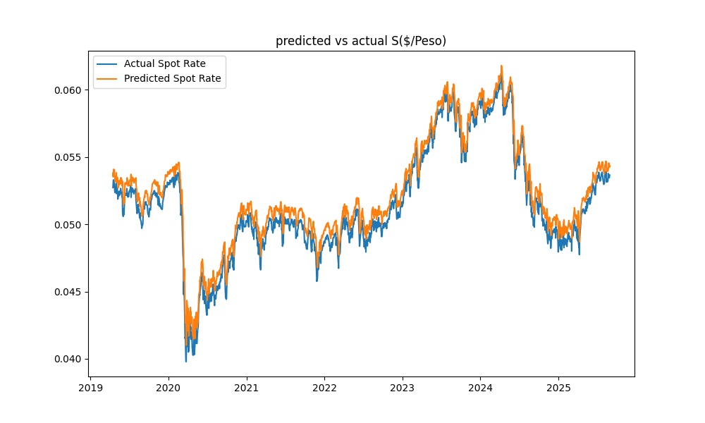
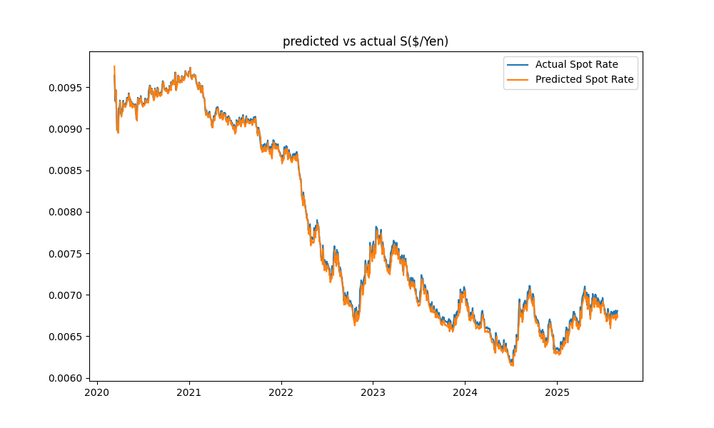
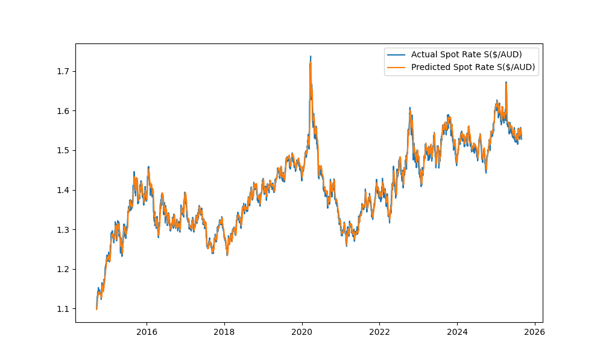

### Spot Rate Forecasting
These forecast consists of the following currency pairs: S(  $/pound  ), S(  $/Euro  ), S(  $/peso  ), S (  $/AUD  ), S(  $/YEN  ) I will quote the currency in American Terms. Example: 
```text
S($/pound) = 1.33 -> 1 pound = 1.33 $
S(pound/$) = 1 / S($/pound) = 1 / 1.33 $ -> .75 pound = 1 $
S($/pound) = 1 / S(pound/$) = 1 / .75 -> 1 pound = 1.33 $
```

The 1:1 parity always holds. There are examples of arbitrage being available for investors to make profit. For example, the Uncovered Interest Rate Parity, however this does not hold long and has to do with taking advantage of a domestic countries interest rates.


### Requirements
```bash
pip install matplotlib seaborn pandas scikit-learn torch torchvision torchaudio numpy fred
```


### LSTM
```python
class LSTM(nn.Module):
    def __init__(self,input_size,hidden_size,num_layers,output_size):
        super(LSTM,self).__init__()
        self.input_size = input_size
        self.hidden_size = hidden_size
        self.num_layers = num_layers
        self.output_size = output_size
        self.lstm = nn.LSTM(input_size,hidden_size,num_layers,batch_first=True)
        
        self.fc = nn.Linear(hidden_size,output_size)
        
    def forward(self,X):
        h0 = torch.zeros(1,X.size(0),self.hidden_size)
        c0 = torch.zeros(1,X.size(0),self.hidden_size)
        out,_ = self.lstm(X,(h0,c0))
        out = self.fc(out[:,-1,:])
        return out

```


### S($/GBP) Results



```text
Mean Absolute Percentage Error: 0.0064
R2 Score: 99.24%
Root Mean Squared Error: 0.0117
            Date  Actual Spot Rate  Predicted Spot Rate
10596 2013-03-21            1.5180               1.5124
10597 2013-03-22            1.5239               1.5133
10598 2013-03-25            1.5184               1.5158
10599 2013-03-26            1.5156               1.5176
10600 2013-03-27            1.5112               1.5194
10601 2013-03-28            1.5184               1.5188
10602 2013-03-29            1.5193               1.5166
10603 2013-04-01            1.5232               1.5158
10604 2013-04-02            1.5113               1.5171
10605 2013-04-03            1.5140               1.5183
10606 2013-04-04            1.5198               1.5182
10607 2013-04-05            1.5336               1.5180
10608 2013-04-08            1.5257               1.5180
10609 2013-04-09            1.5317               1.5214
10610 2013-04-10            1.5315               1.5270
10611 2013-04-11            1.5403               1.5309
10612 2013-04-12            1.5373               1.5312
10613 2013-04-15            1.5320               1.5343
10614 2013-04-16            1.5316               1.5351
10615 2013-04-17            1.5255               1.5365
            Date  Actual Spot Rate  Predicted Spot Rate
13736 2025-10-10            1.3343               1.3439
13737 2025-10-14            1.3321               1.3405
13738 2025-10-15            1.3396               1.3367
13739 2025-10-16            1.3425               1.3357
13740 2025-10-17            1.3425               1.3381
13741 2025-10-20            1.3420               1.3398
13742 2025-10-21            1.3391               1.3432
13743 2025-10-22            1.3372               1.3436
13744 2025-10-23            1.3323               1.3426
13745 2025-10-24            1.3298               1.3404
13746 2025-10-27            1.3331               1.3376
13747 2025-10-28            1.3280               1.3358
13748 2025-10-29            1.3243               1.3329
13749 2025-10-30            1.3147               1.3314
13750 2025-10-31            1.3141               1.3288
13751 2025-11-03            1.3150               1.3242
13752 2025-11-04            1.3044               1.3203
13753 2025-11-05            1.3051               1.3149
13754 2025-11-06            1.3107               1.3132
13755 2025-11-07            1.3165               1.3119
```


### GRU Results S(USD/PESO)



```
Date  Actual Spot Rate  Predicted Spot Rate
6381 2019-04-16            0.0527               0.0538
6382 2019-04-17            0.0531               0.0535
6383 2019-04-18            0.0533               0.0539
6384 2019-04-19            0.0533               0.0541
6385 2019-04-22            0.0531               0.0541
6386 2019-04-23            0.0528               0.0539
6387 2019-04-24            0.0526               0.0536
6388 2019-04-25            0.0524               0.0534
6389 2019-04-26            0.0528               0.0532
6390 2019-04-29            0.0526               0.0536
6391 2019-04-30            0.0526               0.0534
6392 2019-05-01            0.0530               0.0535
6393 2019-05-02            0.0523               0.0538
6394 2019-05-03            0.0527               0.0531
6395 2019-05-06            0.0527               0.0535
6396 2019-05-07            0.0525               0.0535
6397 2019-05-08            0.0524               0.0533
6398 2019-05-09            0.0519               0.0532
6399 2019-05-10            0.0523               0.0527
6400 2019-05-13            0.0521               0.0531
           Date  Actual Spot Rate  Predicted Spot Rate
7956 2025-08-04            0.0530               0.0538
7957 2025-08-05            0.0533               0.0538
7958 2025-08-06            0.0536               0.0541
7959 2025-08-07            0.0535               0.0544
7960 2025-08-08            0.0539               0.0543
7961 2025-08-11            0.0536               0.0547
7962 2025-08-12            0.0539               0.0544
7963 2025-08-13            0.0536               0.0547
7964 2025-08-14            0.0531               0.0544
7965 2025-08-15            0.0534               0.0539
7966 2025-08-18            0.0532               0.0542
7967 2025-08-19            0.0532               0.0540
7968 2025-08-20            0.0532               0.0540
7969 2025-08-21            0.0532               0.0540
7970 2025-08-22            0.0538               0.0540
7971 2025-08-25            0.0537               0.0546
7972 2025-08-26            0.0536               0.0544
7973 2025-08-27            0.0535               0.0544
7974 2025-08-28            0.0536               0.0542
7975 2025-08-29            0.0537               0.0544
```
### Bidirectional LSTM S($/YEN)

```text
Root Mean Squared Error: 0.0001
R2 Score: 99.56
Mean Average Percentage Error: 0.007509
         Date  Actual Spot Rate  Predicted Spot Rate
0  2020-05-19          0.009269             0.009340
1  2020-05-20          0.009306             0.009321
2  2020-05-21          0.009286             0.009327
3  2020-05-22          0.009302             0.009322
4  2020-05-26          0.009290             0.009315
5  2020-05-27          0.009277             0.009307
6  2020-05-28          0.009288             0.009300
7  2020-05-29          0.009279             0.009295
8  2020-06-01          0.009297             0.009297
9  2020-06-02          0.009208             0.009295
10 2020-06-03          0.009184             0.009283
11 2020-06-04          0.009174             0.009269
12 2020-06-05          0.009117             0.009254
13 2020-06-08          0.009220             0.009231
14 2020-06-09          0.009289             0.009224
15 2020-06-10          0.009324             0.009221
16 2020-06-11          0.009375             0.009220
17 2020-06-12          0.009314             0.009241
18 2020-06-15          0.009317             0.009257
19 2020-06-16          0.009315             0.009281
           Date  Actual Spot Rate  Predicted Spot Rate
1348 2025-10-10          0.006582             0.006683
1349 2025-10-14          0.006589             0.006652
1350 2025-10-15          0.006613             0.006619
1351 2025-10-16          0.006633             0.006590
1352 2025-10-17          0.006652             0.006582
1353 2025-10-20          0.006641             0.006585
1354 2025-10-21          0.006591             0.006598
1355 2025-10-22          0.006588             0.006608
1356 2025-10-23          0.006548             0.006612
1357 2025-10-24          0.006544             0.006607
1358 2025-10-27          0.006532             0.006599
1359 2025-10-28          0.006573             0.006585
1360 2025-10-29          0.006583             0.006573
1361 2025-10-30          0.006486             0.006562
1362 2025-10-31          0.006491             0.006545
1363 2025-11-03          0.006488             0.006534
1364 2025-11-04          0.006513             0.006527
1365 2025-11-05          0.006489             0.006523
1366 2025-11-06          0.006537             0.006515
1367 2025-11-07          0.006533             0.006509
```

### BI-LSTM S($/AUD)

```text
R2-Score: 98.52%
Mean Absolute Percentage Error: 0.006771
Root Mean Squared Error: 0.0126
            Date  Actual Spot Rate  Predicted Spot Rate
10964 2014-09-16          1.099384             1.097523
10965 2014-09-17          1.107665             1.098645
10966 2014-09-18          1.113090             1.101400
10967 2014-09-19          1.119194             1.103623
10968 2014-09-22          1.126634             1.106931
10969 2014-09-23          1.129561             1.113833
10970 2014-09-24          1.127396             1.119263
10971 2014-09-25          1.136880             1.122511
10972 2014-09-26          1.141422             1.127151
10973 2014-09-29          1.144427             1.131037
10974 2014-09-30          1.144558             1.134890
10975 2014-10-01          1.144951             1.138901
10976 2014-10-02          1.137268             1.140789
10977 2014-10-03          1.152738             1.139296
10978 2014-10-06          1.143249             1.142092
10979 2014-10-07          1.135332             1.141414
10980 2014-10-08          1.142727             1.138666
10981 2014-10-09          1.139212             1.140024
10982 2014-10-10          1.146921             1.136823
10983 2014-10-14          1.145869             1.138254
            Date  Actual Spot Rate  Predicted Spot Rate
13681 2025-08-04          1.546312             1.551783
13682 2025-08-05          1.545117             1.553777
13683 2025-08-06          1.537515             1.552483
13684 2025-08-07          1.537988             1.547950
13685 2025-08-08          1.531863             1.545973
13686 2025-08-11          1.535627             1.542185
13687 2025-08-12          1.530925             1.540258
13688 2025-08-13          1.527650             1.538430
13689 2025-08-14          1.540832             1.535814
13690 2025-08-15          1.534919             1.538715
13691 2025-08-18          1.539883             1.538410
13692 2025-08-19          1.548227             1.540832
13693 2025-08-20          1.555694             1.546081
13694 2025-08-21          1.557390             1.550304
13695 2025-08-22          1.542020             1.555713
13696 2025-08-25          1.538461             1.555036
13697 2025-08-26          1.538461             1.552158
13698 2025-08-27          1.539409             1.548034
13699 2025-08-28          1.530925             1.544141
13700 2025-08-29          1.527884             1.541027
```

### S(USD/EURO)

```text
RMSE: 0.005303109530359507
R2 Score: 99.18%
         Date  Actual Spot Rate  Predicted Spot Rate
0  2020-04-24            1.0798             1.080576
1  2020-04-27            1.0829             1.078898
2  2020-04-28            1.0836             1.081957
3  2020-04-29            1.0853             1.082648
4  2020-04-30            1.0934             1.084326
5  2020-05-01            1.0998             1.092327
6  2020-05-04            1.0911             1.098654
7  2020-05-05            1.0844             1.090054
8  2020-05-06            1.0806             1.083438
9  2020-05-07            1.0815             1.079688
10 2020-05-08            1.0854             1.080576
11 2020-05-11            1.0818             1.084425
12 2020-05-12            1.0864             1.080872
13 2020-05-13            1.0837             1.085412
14 2020-05-14            1.0800             1.082747
15 2020-05-15            1.0816             1.079096
16 2020-05-18            1.0904             1.080674
17 2020-05-19            1.0937             1.089363
18 2020-05-20            1.0980             1.092623
19 2020-05-21            1.0953             1.096874
           Date  Actual Spot Rate  Predicted Spot Rate
1317 2025-08-04            1.1568             1.153937
1318 2025-08-05            1.1580             1.155232
1319 2025-08-06            1.1647             1.156427
1320 2025-08-07            1.1641             1.163104
1321 2025-08-08            1.1660             1.162506
1322 2025-08-11            1.1607             1.164401
1323 2025-08-12            1.1673             1.159117
1324 2025-08-13            1.1715             1.165697
1325 2025-08-14            1.1644             1.169887
1326 2025-08-15            1.1708             1.162805
1327 2025-08-18            1.1667             1.169189
1328 2025-08-19            1.1660             1.165099
1329 2025-08-20            1.1649             1.164401
1330 2025-08-21            1.1605             1.163304
1331 2025-08-22            1.1713             1.158918
1332 2025-08-25            1.1670             1.169688
1333 2025-08-26            1.1657             1.165398
1334 2025-08-27            1.1611             1.164101
1335 2025-08-28            1.1672             1.159516
1336 2025-08-29            1.1695             1.165597
```


