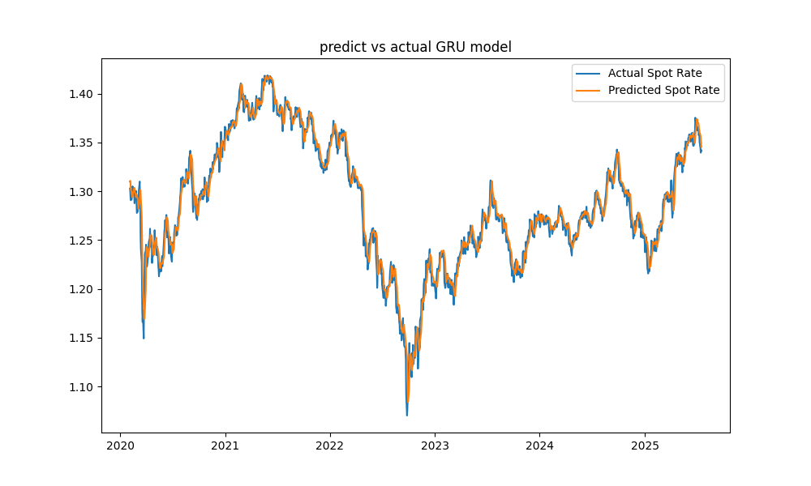

### Spot Rate Forecasting
This is a forecast between the US Dollar and UK Pound. There is no arbitrage in the Foreign Exchange Market. Since, I am American, I will quote the currency in American Terms. Example: 
```text
S($/pound) = 1.33 -> 1 pound = 1.33 $
S(pound/$) = 1 / S($/pound) = 1 / 1.33 $ -> .75 pound = 1 $
S($/pound) = 1 / S(pound/$) = 1 / .75 -> 1 pound = 1.33 $
```

The 1:1 parity always holds. There are examples of arbitrage being available for investors to make profit. For example, the Uncovered Interest Rate Parity, however this does not hold long and has to do with taking advantage of a domestic countries interest rates.

* Note
I am not a 'Finance Guy'. I majored in Econ and come from that Neumann cloth. No, I guess I can do this, yes. By transitivity,
Economics has everything that Finance has and no vice versa. So, dominance. Stricly Dominant. No best response.
This may sound immature, I had to give a 'shout out' to Economics. They gave me all of this and they did not have to. Thank you.

### Requirements
```bash
pip install matplotlib seaborn pandas scikit-learn torch torchvision torchaudio numpy fred
```


### Example of S(pound/$)


Notice, the two graphs are completely inverse.

### LSTM
```python
class LSTM(nn.Module):
    def __init__(self,input_size,hidden_size,num_layers,output_size):
        super(LSTM,self).__init__()
        self.input_size = input_size
        self.hidden_size = hidden_size
        self.num_layers = num_layers
        self.output_size = output_size
        self.lstm = nn.LSTM(input_size,hidden_size,num_layers,batch_first=True)
        
        self.fc = nn.Linear(hidden_size,output_size)
        
    def forward(self,X):
        h0 = torch.zeros(1,X.size(0),self.hidden_size)
        c0 = torch.zeros(1,X.size(0),self.hidden_size)
        out,_ = self.lstm(X,(h0,c0))
        out = self.fc(out[:,-1,:])
        return out


model = LSTM(input_size=1,hidden_size=512,num_layers=1,output_size=1)
optimizer = torch.optim.Adam(model.parameters(),lr=0.001)
loss_fn = nn.MSELoss()
epochs = 200


for epoch in range(epochs):
    y_pred = model(X_train)
    loss = loss_fn(y_pred.float(),y_train)
    optimizer.zero_grad()
    loss.backward()
    optimizer.step()
    if epoch % 1 != 0:
        continue
    model.eval()
    with torch.no_grad():
        y_pred = model(X_train)
        train_rsme = np.sqrt(loss_fn(y_pred,y_train))
        y_pred_test =  model(X_test)
        test_rsme = np.sqrt(loss_fn(y_pred_test,y_test))
        print(f'Epoch: {epoch}; train_RSEM: {train_rsme:.4}; Test RSME: {test_rsme:.4}')
```

After the train/test split, scaling, sliding window etc., the LSTM class is defined and the training and testing data is evaluated

### The Results


```text

            Date  Actual Spot Rate  Predicted Spot Rate
            Date  Actual Spot Rate  Predicted Spot Rate
Date  Actual Spot Rate  Predicted Spot Rate
12314 2020-02-04            1.3029               1.3171
12315 2020-02-05            1.3000               1.3190
12316 2020-02-06            1.2935               1.3168
12317 2020-02-07            1.2908               1.3098
12318 2020-02-10            1.2919               1.3081
12319 2020-02-11            1.2945               1.3049
12320 2020-02-12            1.2978               1.3025
12321 2020-02-13            1.3051               1.3029
12322 2020-02-14            1.3039               1.3056
12323 2020-02-18            1.3017               1.3087
12324 2020-02-19            1.2934               1.3113
12325 2020-02-20            1.2877               1.3119
12326 2020-02-21            1.2966               1.3085
12327 2020-02-24            1.2923               1.3053
12328 2020-02-25            1.3004               1.3024
12329 2020-02-26            1.2921               1.3031
12330 2020-02-27            1.2876               1.3055
12331 2020-02-28            1.2778               1.3040
12332 2020-03-02            1.2791               1.3023
12333 2020-03-03            1.2827               1.2964
            Date  Actual Spot Rate  Predicted Spot Rate
13657 2025-06-18            1.3471               1.3646
13658 2025-06-20            1.3465               1.3626
13659 2025-06-23            1.3491               1.3594
13660 2025-06-24            1.3616               1.3555
13661 2025-06-25            1.3626               1.3559
13662 2025-06-26            1.3754               1.3592
13663 2025-06-27            1.3720               1.3654
13664 2025-06-30            1.3722               1.3721
13665 2025-07-01            1.3728               1.3754
13666 2025-07-02            1.3623               1.3788
13667 2025-07-03            1.3656               1.3765
13668 2025-07-07            1.3638               1.3750
13669 2025-07-08            1.3575               1.3727
13670 2025-07-09            1.3585               1.3690
13671 2025-07-10            1.3569               1.3684
13672 2025-07-11            1.3503               1.3660
13673 2025-07-14            1.3437               1.3630
13674 2025-07-15            1.3396               1.3607
13675 2025-07-16            1.3426               1.3565
13676 2025-07-17            1.3413               1.3519

```

**** GRU Results



```
text
Date  Actual Spot Rate  Predicted Spot Rate
12314 2020-02-04            1.3029               1.3095
12315 2020-02-05            1.3000               1.3104
12316 2020-02-06            1.2935               1.3077
12317 2020-02-07            1.2908               1.3011
12318 2020-02-10            1.2919               1.2988
12319 2020-02-11            1.2945               1.2956
12320 2020-02-12            1.2978               1.2937
12321 2020-02-13            1.3051               1.2944
12322 2020-02-14            1.3039               1.2975
12323 2020-02-18            1.3017               1.3009
12324 2020-02-19            1.2934               1.3032
12325 2020-02-20            1.2877               1.3031
12326 2020-02-21            1.2966               1.2991
12327 2020-02-24            1.2923               1.2961
12328 2020-02-25            1.3004               1.2936
12329 2020-02-26            1.2921               1.2948
12330 2020-02-27            1.2876               1.2968
12331 2020-02-28            1.2778               1.2950
12332 2020-03-02            1.2791               1.2922
12333 2020-03-03            1.2827               1.2863
            Date  Actual Spot Rate  Predicted Spot Rate
13657 2025-06-18            1.3471               1.3588
13658 2025-06-20            1.3465               1.3563
13659 2025-06-23            1.3491               1.3528
13660 2025-06-24            1.3616               1.3494
13661 2025-06-25            1.3626               1.3506
13662 2025-06-26            1.3754               1.3545
13663 2025-06-27            1.3720               1.3612
13664 2025-06-30            1.3722               1.3678
13665 2025-07-01            1.3728               1.3709
13666 2025-07-02            1.3623               1.3738
13667 2025-07-03            1.3656               1.3713
13668 2025-07-07            1.3638               1.3694
13669 2025-07-08            1.3575               1.3671
13670 2025-07-09            1.3585               1.3635
13671 2025-07-10            1.3569               1.3625
13672 2025-07-11            1.3503               1.3602
13673 2025-07-14            1.3437               1.3571
13674 2025-07-15            1.3396               1.3542
13675 2025-07-16            1.3426               1.3495
13676 2025-07-17            1.3413               1.3452
```
### Bidirectional LSTM Forecast Results

```
text
Date  Actual Spot Rate  Predicted Spot Rate
12314 2020-02-04            1.3029               1.3083
12315 2020-02-05            1.3000               1.3109
12316 2020-02-06            1.2935               1.3087
12317 2020-02-07            1.2908               1.3011
12318 2020-02-10            1.2919               1.2994
12319 2020-02-11            1.2945               1.2963
12320 2020-02-12            1.2978               1.2941
12321 2020-02-13            1.3051               1.2945
12322 2020-02-14            1.3039               1.2976
12323 2020-02-18            1.3017               1.3005
12324 2020-02-19            1.2934               1.3030
12325 2020-02-20            1.2877               1.3032
12326 2020-02-21            1.2966               1.2996
12327 2020-02-24            1.2923               1.2972
12328 2020-02-25            1.3004               1.2936
12329 2020-02-26            1.2921               1.2948
12330 2020-02-27            1.2876               1.2967
12331 2020-02-28            1.2778               1.2950
12332 2020-03-02            1.2791               1.2928
12333 2020-03-03            1.2827               1.2872
            Date  Actual Spot Rate  Predicted Spot Rate
13657 2025-06-18            1.3471               1.3586
13658 2025-06-20            1.3465               1.3565
13659 2025-06-23            1.3491               1.3535
13660 2025-06-24            1.3616               1.3498
13661 2025-06-25            1.3626               1.3509
13662 2025-06-26            1.3754               1.3539
13663 2025-06-27            1.3720               1.3608
13664 2025-06-30            1.3722               1.3671
13665 2025-07-01            1.3728               1.3704
13666 2025-07-02            1.3623               1.3740
13667 2025-07-03            1.3656               1.3710
13668 2025-07-07            1.3638               1.3699
13669 2025-07-08            1.3575               1.3675
13670 2025-07-09            1.3585               1.3633
13671 2025-07-10            1.3569               1.3629
13672 2025-07-11            1.3503               1.3605
13673 2025-07-14            1.3437               1.3570
13674 2025-07-15            1.3396               1.3545
13675 2025-07-16            1.3426               1.3501
13676 2025-07-17            1.3413               1.3459
```

### Tradtional ML Forecast's (RandomForest was selected)

```
text
Best R2 Score: 0.9993497636144928
Mean Absolute Squared Error: 0.008855921672115479
Predicted Vs Actual Prices using Random Forest

       Actual  Predicted
5      2.3972   2.396398
7      2.4001   2.400693
18     2.4161   2.416018
23     2.4184   2.417746
29     2.4158   2.415996
...       ...        ...
13631  1.3318   1.330326
13633  1.3280   1.327498
13639  1.3447   1.337477
13640  1.3426   1.345368
13653  1.3556   1.357060

[1368 rows x 2 columns]
     Actual  Predicted
5    2.3972   2.396398
7    2.4001   2.400693
18   2.4161   2.416018
23   2.4184   2.417746
29   2.4158   2.415996
33   2.4190   2.419161
36   2.4193   2.418763
45   2.4188   2.419134
73   2.4186   2.418361
86   2.4194   2.418543
92   2.4183   2.417946
93   2.4186   2.418404
100  2.4190   2.419315
105  2.4170   2.417145
107  2.4190   2.418260
108  2.4192   2.418956
113  2.4186   2.418963
116  2.4189   2.419175
129  2.4187   2.418224
136  2.4189   2.418603
       Actual  Predicted
13444  1.2766   1.274264
13446  1.2828   1.283888
13456  1.3235   1.318642
13474  1.3351   1.336239
13490  1.3000   1.305386
13498  1.2981   1.299513
13523  1.2712   1.269507
13532  1.2718   1.267860
13550  1.2188   1.218362
13551  1.2214   1.221513
13560  1.2435   1.243926
13571  1.2528   1.255083
13579  1.2696   1.263653
13581  1.2591   1.264266
13596  1.2896   1.297031
13631  1.3318   1.330326
13633  1.3280   1.327498
13639  1.3447   1.337477
13640  1.3426   1.345368
13653  1.3556   1.357060
```


