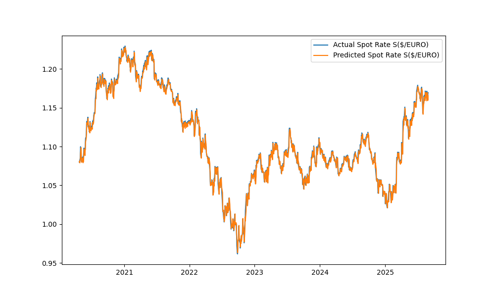

### Spot Rate Forecasting
This is a forecast between the US Dollar and UK Pound. There is no arbitrage in the Foreign Exchange Market. Since, I am American, I will quote the currency in American Terms. Example: 
```text
S($/pound) = 1.33 -> 1 pound = 1.33 $
S(pound/$) = 1 / S($/pound) = 1 / 1.33 $ -> .75 pound = 1 $
S($/pound) = 1 / S(pound/$) = 1 / .75 -> 1 pound = 1.33 $
```

The 1:1 parity always holds. There are examples of arbitrage being available for investors to make profit. For example, the Uncovered Interest Rate Parity, however this does not hold long and has to do with taking advantage of a domestic countries interest rates.

### Requirements
```bash
pip install matplotlib seaborn pandas scikit-learn torch torchvision torchaudio numpy fred
```


### Example of S(pound/$)


Notice, the two graphs are completely inverse.

### LSTM
```python
class LSTM(nn.Module):
    def __init__(self,input_size,hidden_size,num_layers,output_size):
        super(LSTM,self).__init__()
        self.input_size = input_size
        self.hidden_size = hidden_size
        self.num_layers = num_layers
        self.output_size = output_size
        self.lstm = nn.LSTM(input_size,hidden_size,num_layers,batch_first=True)
        
        self.fc = nn.Linear(hidden_size,output_size)
        
    def forward(self,X):
        h0 = torch.zeros(1,X.size(0),self.hidden_size)
        c0 = torch.zeros(1,X.size(0),self.hidden_size)
        out,_ = self.lstm(X,(h0,c0))
        out = self.fc(out[:,-1,:])
        return out


model = LSTM(input_size=1,hidden_size=512,num_layers=1,output_size=1)
optimizer = torch.optim.Adam(model.parameters(),lr=0.001)
loss_fn = nn.MSELoss()
epochs = 200


for epoch in range(epochs):
    y_pred = model(X_train)
    loss = loss_fn(y_pred.float(),y_train)
    optimizer.zero_grad()
    loss.backward()
    optimizer.step()
    if epoch % 1 != 0:
        continue
    model.eval()
    with torch.no_grad():
        y_pred = model(X_train)
        train_rsme = np.sqrt(loss_fn(y_pred,y_train))
        y_pred_test =  model(X_test)
        test_rsme = np.sqrt(loss_fn(y_pred_test,y_test))
        print(f'Epoch: {epoch}; train_RSEM: {train_rsme:.4}; Test RSME: {test_rsme:.4}')
```

After the train/test split, scaling, sliding window etc., the LSTM class is defined and the training and testing data is evaluated

### The Results



```text

            Date  Actual Spot Rate  Predicted Spot Rate
            Date  Actual Spot Rate  Predicted Spot Rate
12296 2020-01-08            1.3110               1.3171
12297 2020-01-09            1.3069               1.3176
12298 2020-01-10            1.3060               1.3169
12299 2020-01-13            1.2983               1.3139
12300 2020-01-14            1.3018               1.3124
12301 2020-01-15            1.3030               1.3112
12302 2020-01-16            1.3076               1.3089
12303 2020-01-17            1.3029               1.3075
12304 2020-01-21            1.3047               1.3064
12305 2020-01-22            1.3136               1.3060
12306 2020-01-23            1.3104               1.3064
12307 2020-01-24            1.3071               1.3083
12308 2020-01-27            1.3054               1.3094
12309 2020-01-28            1.2996               1.3102
12310 2020-01-29            1.3012               1.3096
12311 2020-01-30            1.3106               1.3094
12312 2020-01-31            1.3195               1.3095
12313 2020-02-03            1.3006               1.3092
12314 2020-02-04            1.3029               1.3088
12315 2020-02-05            1.3000               1.3086
            Date  Actual Spot Rate  Predicted Spot Rate
13634 2025-05-15            1.3292               1.3324
13635 2025-05-16            1.3257               1.3310
13636 2025-05-19            1.3357               1.3299
13637 2025-05-20            1.3371               1.3303
13638 2025-05-21            1.3447               1.3306
13639 2025-05-22            1.3426               1.3338
13640 2025-05-23            1.3511               1.3360
13641 2025-05-27            1.3505               1.3386
13642 2025-05-28            1.3462               1.3418
13643 2025-05-29            1.3489               1.3454
13644 2025-05-30            1.3468               1.3475
13645 2025-06-02            1.3549               1.3492
13646 2025-06-03            1.3520               1.3502
13647 2025-06-04            1.3570               1.3516
13648 2025-06-05            1.3584               1.3521
13649 2025-06-06            1.3532               1.3531
13650 2025-06-09            1.3563               1.3546
13651 2025-06-10            1.3508               1.3557
13652 2025-06-11            1.3556               1.3568
13653 2025-06-12            1.3589               1.3567


```


